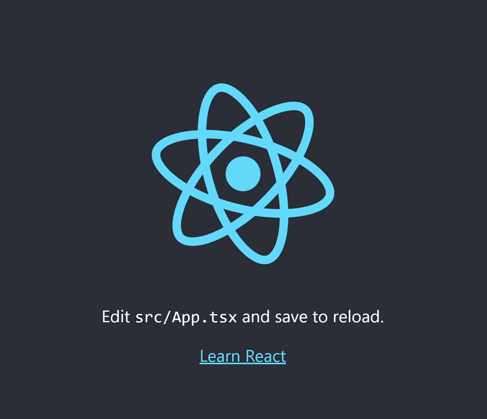

# Create React App

### Create React App

We gebruiken `create-react-app` om snel een eerste applicatie op te zetten. Dit is een startscript om snel een React applicatie aan te maken. Het vereist geen configuratie en wordt aangeraden voor beginnende React gebruikers.

Voordat we kunnen werken met de `create-react-app` kijk je best ook nog na of je `npx` hebt geinstalleerd op jouw machine. Normaal wordt dit mee geïnstalleerd met `node` en `npm`.

Je kan dit nakijken door op de command line `npx --version` te typen.

`npx` laat toe om tooling te gebruiken zonder die eerst te installeren op jouw machine. Zo heb je altijd de laatste nieuwe versie van deze tool. Je zou eventueel deze ook kunnen installeren op jouw machine met `npm install -g`, maar dan zou je zelf verantwoordelijk zijn voor het updaten van deze tool.

Nu we dit klaar hebben staan kunnen we onze eerste React applicatie aanmaken door volgend commando uit te voeren:

```
npx create-react-app our-first-react-app --template typescript
```

:::caution
Let op dat je het stuk `--template typescript` niet vergeet. We werken in deze cursus met TypeScript. Anders wordt er een React applicatie gemaakt in JavaScript.
:::

We kunnen nu de folder `our-first-react-app` openen in Visual Studio Code en naar de inhoud van het project kijken:


Hier merk je onder andere volgende bestanden en folders in op:

* **node\_modules** deze folder bevat alle packages die werden geïnstalleerd bij het runnen van het `create-react-app` commando. Alle packages die je zelf installeert met `npm install` zullen ook in deze folder terecht komen. **Normaal doe je nooit rechtstreeks aanpassingen in deze folder.**
* **package.json** beschrijft welke packages geïnstalleerd moeten zijn om deze applicatie uit te voeren. We noemen dit ook de **dependencies** van de applicatie. Het `npm install` commando zal deze dependencies dan installeren in de `node_modules` folder.
* **src** bevat de eigenlijke bestanden die rechtstreeks te maken hebben met react. Hier zal jouw broncode in komen. Het belangrijkste bestand op dit moment is het `App.tsx` bestand. Daar zullen we eerst onze eerste React code schrijven. Later zullen we dit opsplitsen in verschillende bestanden om het overzicht te bewaren.
* **public** bevat het HTML-bestand waarin de react applicatie zal getoond worden. Hier moet je meestal niets voor aanpassen want alle visuele componenten worden in react zelf gerenderd. Deze folder bevat ook andere dingen zoals het icoontje dat je in het tabblad van je browser ziet.

Je kan de applicatie opstarten door `npm start` uit te voeren in je terminal venster. Als alles in orde is zal je browser automatisch openen op de eerste en enige pagina van jouw webapplicatie:



### Je eerste component

Alle React applicaties zijn gebouwd uit verschillende React **componenten**. Componenten stellen afgebakende stukjes van de applicatie voor. Ze worden in moderne React code uitgedrukt als functies. Ze accepteren invoerwaarden (deze noemen we “props”) en geven een beschrijving terug van wat er in de gegenereerde pagina zou moeten staan. Met componenten splits je de UI in onafhankelijke, herbruikbare delen.

Het eerste component waar je altijd mee in aanraking zal komen kan je vinden in het `src/App.tsx` bestand. Deze zal er een beetje zoals het onderstaand bestand uitzien:

```typescript codesandbox={"template": "react-starter", "filename": "src/App.tsx"}
import React from 'react';
import logo from './logo.svg';
import './App.css';

function App() {
  return (
    <div className="App">
      <header className="App-header">
        
        <p>
          Edit <code>src/App.tsx</code> and save to reload.
        </p>
        <a
          className="App-link"
          href="https://reactjs.org"
          target="_blank"
          rel="noopener noreferrer"
        >
          Learn React
        </a>
      </header>
    </div>
  );
}

export default App;
```

:::info
Je bestand heet `App`**`.tsx`**, niet `App.ts`. Het bevat geen alledaagse TypeScript code. Het maakt ook gebruik van de TSX-syntax, die verderop wordt uitgelegd. Als je de extensie verkeerd invult, zal je een foutmelding krijgen.
:::

We zullen nu even het component herleiden tot de essentie door wat overbodige boilerplate code weg te halen. Zo bekomen we tot een heel eenvoudige `Hello world` applicatie:

```typescript codesandbox={"template": "react", "filename": "src/App.tsx"}
import React from "react";

const App = () => {
  return (
    <div>
      <h1>Hello World</h1>
    </div>
  );
};

export default App;
```

We zien hier een aantal dingen:

* We zien hier eigenlijk gewoon een eenvoudige functie. We noemen deze in React geen functie maar een **function component**. Op deze manier maken we het onderscheid duidelijk met functies die werk verrichten dat niet rechstreeks zichtbaar is.
* Deze function component heeft geen parameters, maar in verdere delen zullen we zien dat we ook parameters kunnen meegeven aan componenten. Parameters van een component heten **props**.
* Deze functie returnt een waarde die genoteerd is in een HTML-achtige syntax. Deze HTML-achtige syntax heet **TSX**. Ook al ziet dit er grotendeels uit als HTML, is het eigenlijk TypeScript.
  * Om TSX over meerdere regels te kunnen spreiden zonder last te hebben van automatische puntkomma's, zetten we de hele TSX-expressie tussen ronde haakjes.
  * Af en toe zijn er lichte verschillen met echte HTML. Je ziet dit bijvoorbeeld aan het gebruik van `className`. In echte HTML is dit `class`.

:::info
Wanneer React gebruikt wordt met JavaScript, spreekt men over JSX in plaats van TSX.
:::

Omdat de component een functie is, kunnen we in de body van de functie alles doen wat onder normale omstandigheden kan in TypeScript functies. We kunnen bijvoorbeeld, voor we de `return` uitvoeren, variabelen initialiseren en berekeningen uitvoeren:

```typescript codesandbox={"template": "react-starter", "filename": "src/App.tsx"}
import React from 'react';

const App = () => {
  // we bevinden ons in de body van een TypeScript functie
  // we kunnen dus variabelen aanmaken zoals anders
  const title = "World";
  return (
    <div>
      <h1>Hello World</h1>
    </div>
  );
}

export default App;
```