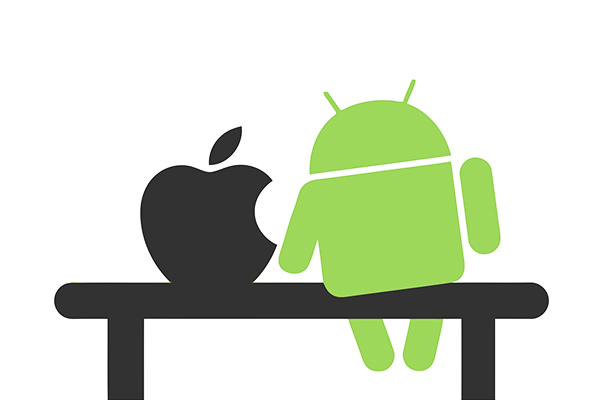
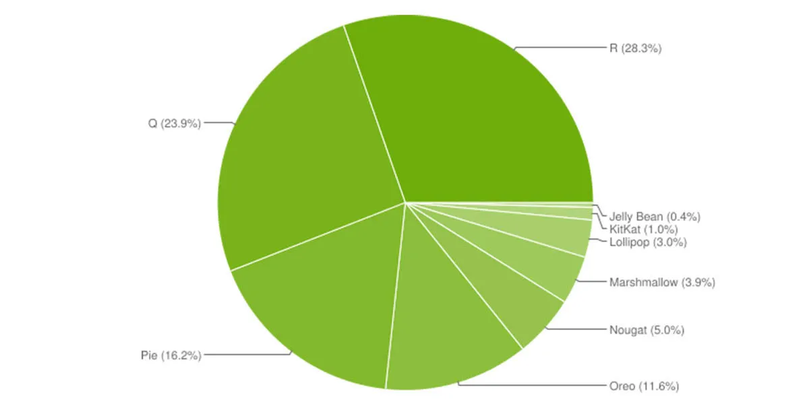

# Inleiding

## Verschillende platformen

  

### Android

Android is een open source operating system dat ontwikkeld wordt door Google. Het is een van de meest gebruikte mobiele operating systems ter wereld. 

Android Studio is een IDE die ontwikkeld is voor Android ontwikkelaars. Het is een volledige IDE die ondersteuning biedt voor het ontwikkelen van Android apps. Het is een gratis IDE die je kan downloaden op de [Android Studio website](https://developer.android.com/studio/). Je kan apps maken voor Android met behulp van Java, Kotlin of C++.

Apps worden gepubliceerd op de Google Play Store. De kostprijs om een app te publiceren is 25 euro. 

### iOS

iOS is een gesloten operating system dat ontwikkeld wordt door Apple. 

XCode is een IDE die ontwikkeld is voor iOS ontwikkelaars. Je kan deze IDE enkel op een Mac installeren. Je kan apps maken voor iOS met behulp van Swift of Objective-C.

Apps worden gepubliceerd op de App Store. De kostprijs om een app te publiceren is 99 euro per jaar.

### Problemen

#### Verschillen in platforms

We zitten dus met een probleem. Als je een app wil maken voor Android en iOS, moet je twee verschillende IDE's gebruiken. Je moet ook twee verschillende programmeertalen leren. Het is dus niet mogelijk om een app te maken voor beide platformen met behulp van één IDE en één programmeertaal.

#### Versie fragmentatie

  

Om het nog moeilijker te maken hebben zijn er ook nog veel verschillende versies van elk platform. Android heeft veel verschillende fabrikanten die niet allemaal even snel updates uitbrengen. Dit zorgt ervoor dat je rekening moet houden met veel verschillende versies van android. 

Het voordeel van Apple is dat zij het eco systeem (hardware, software,...) volledig in handen hebben. Dit zorgt ervoor dat ze sneller updates kunnen uitbrengen en langer ondersteuning geven voor oudere apparaten. Dit zorgt ervoor dat je minder rekening moet houden met verschillende versies van iOS. 

## Native vs Cross-platform

### Native

Er wordt een app ontwikkeld voor elk platform. Dit zorgt ervoor dat je gebruik kan maken van alle features van het platform. Het nadeel hierbij is dat je twee verschillende apps moet ontwikkelen. Je moet dus twee verschillende IDE's gebruiken en twee verschillende programmeertalen leren.

Voordelen:
- Gebruik kan maken van alle features van het platform
- Snellere performance
- Betere user experience

Nadelen:
- Twee verschillende apps moeten ontwikkeld worden
- Duurder (meer developers/tijd nodig)
- Apps kunnen verschillen in functionaliteit (en look & feel)

In deze cursus gaan we niet dieper in op ontwikkelen van native apps. 

### Cross-platform

Er wordt één app ontwikkeld die op beide platformen kan uitgevoerd worden. Dit zorgt ervoor dat je maar één app hoeft te ontwikkelen in 1 programmeertaal. Soms heb je nog wel kleine aanpassingen nodig voor elk platform.

Voordelen:
- Veel goedkoper (minder developers/tijd nodig)
- Apps kunnen dezelfde functionaliteit hebben (en look & feel)
- Snellere ontwikkeling

Nadelen:
- Je kan niet alle features van het platform gebruiken
- Lagere performance
- Slechtere user experience

### Cross-platform types

#### Progressive Web Apps (PWA)

Een PWA is een webapp die op een mobiele telefoon kan uitgevoerd worden. Het is een webapp die eruit ziet als een native app. 

Eigenlijk gebruikt de PWA gewoon de browser van je mobiele telefoon. Het is dus niet echt een native app. Het is een webapp die eruit ziet als een native app. Je gebruikt dus ook gewoon een combinatie van HTML, CSS en JavaScript. Je kan hiervoor ook gebruik maken van een framework zoals React/Angular/Vue.

Het is zelfs mogelijk om deze apps te installeren op je mobiele telefoon. Daarvoor heb je dan wel een tool nodig zoals Cordova,Phonegap, Ionic,...

#### Cross platform applicaties met native componenten

Echte cross platform applicaties gebruiken echte native componenten. Alle UI componenten zijn gebouwd uit echte componenten van het platform zelf. Bijvoorbeeld een button zal dus in iOS en Android er anders uitzien. Je schrijft dus gewoon code in één programmeertaal en een framework zorgt ervoor dat de code omgezet wordt naar native code.

Bekende frameworks zijn React Native, Flutter, NativeScript,...

## React Native

In deze cursus gaan we leren werken met React Native!

React Native is een framework om native apps te maken voor iOS en Android. Het is gebaseerd op React.js, een JavaScript library voor het maken van webapps. React Native is ontwikkeld door Meta en wordt veel gebruikt door grote bedrijven zoals Airbnb, Facebook, Instagram, Tesla, Uber en Walmart.

React Native lijkt heel hard op React.js. De meeste React.js code kan je gewoon gebruiken in React Native. De grootste verschillen zijn:
- React Native gebruikt native componenten in plaats van webcomponenten. Dit betekent dat je geen HTML tags gebruikt, maar native componenten zoals `<View>`, `<Text>` en `<Image>`. 
- React Native gebruikt geen CSS bestanden of modules maar inline styles. Dit betekent dat je geen CSS classes kan gebruiken, maar inline styles zoals `style={{ color: 'red' }}`.
- React Native gebruikt geen HTML bestanden maar JavaScript bestanden met de extensie `.js` of `.jsx`.

