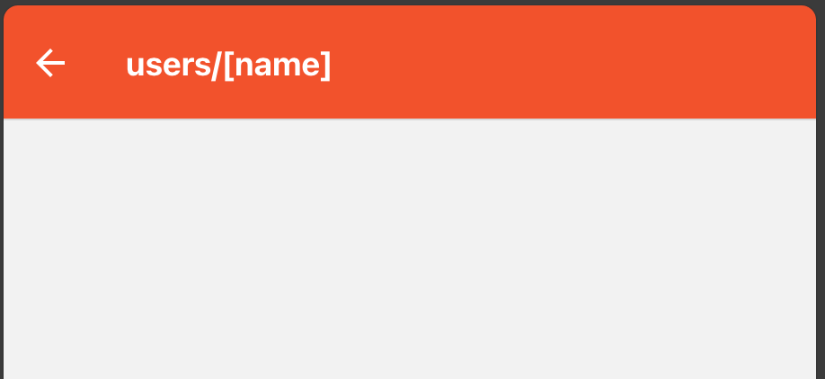

# Expo Router

Expo Router werkt zeer gelijkaardig aan de routing in next.js. Het is een file-based router. Dit wil zeggen dat je een mapstructuur aanmaakt en dat je op basis van de bestandsnaam de route bepaalt. Het laat toe om navigatie tussen schermen in je app te beheren, waardoor gebruikers naadloos tussen verschillende delen van de UI van je app kunnen bewegen, met behulp van dezelfde componenten op meerdere platforms (Android, iOS en web).

Het is gebouwd op [React Navigation](https://reactnavigation.org/), een populaire library voor het beheren van navigatie in React Native apps.

## Installatie

Als je expo-router wil gebruiken in je project moet je eerst enkele packages installeren en een aantal bestanden aanpassen. Deze stappen worden hieronder uitgelegd. 

### Nieuw project

Als je nog geen project hebt kan je een nieuw project aanmaken met een template en hoef je geen ingewikkelde installatie te doen. 

```bash
npx create-expo-app my-project --template expo-template-typescript-router
```

Je moet nog wel de `scheme` property aanpassen in je `app.json` (zie verder).

### Bestaand project

#### Packages installeren

Installeer de library in je project:

```bash
npx expo install expo-router react-native-safe-area-context react-native-screens expo-linking expo-constants expo-status-bar react-native-gesture-handler react-native-web react-dom @react-navigation/drawer react-native-reanimated
```

#### Package.json aanpassen

Pas de `main` property in je `package.json` aan:

```json
{
  "main": "expo-router/entry"
}
```

#### App.js aanpassen

Pas je `App.js` aan:

```jsx
{
  ...
  "scheme": "your-app-scheme"
  ...
  "web": {
    ...
    "bundler": "metro"
  }
}
```

Je moet de `scheme` property aanpassen naar een unieke naam voor je app. Dit is nodig voor deep linking. Je kan hier bijvoorbeeld de naam van je app voor gebruiken. Je moet er wel voor zorgen dat deze naam uniek is. 

#### babel.config.js aanpassen

Je moet de `babel.config.js` aanpassen zodat `expo-router` en `react-native-reanimated` correct werken. 

```
module.exports = function (api) {
  ...
  return {
    ...
    plugins: ['expo-router/babel','react-native-reanimated/plugin'],
  };
};
```

## Schermen toevoegen

Als een bestand wordt aangemaakt in de `app` directory, wordt het automatisch een route in de app. Bijvoorbeeld, de volgende bestanden zullen de volgende routes maken:
- `app/index.js` komt overeen met `/`
- `app/home.js` komt overeen met `/home`
- `app/settings/index.js` komt overeen met `/settings`
- `app/[user].js` komt overeen met dynamische paden zoals `/expo` of `/joske`

Deze paden kunnen worden gebruikt in de `Link` component om te navigeren naar een bepaald scherm. Als je de applicatie op een webbrowser opent, kan je ook de URL aanpassen om naar een bepaald scherm te navigeren.

### Het eerste scherm

Als je nu de applicatie opstart met `expo start` dan krijg je de volgende pagina te zien:


Zoals de melding aangeeft moet je een directory `app` aanmaken met daarin een bestand `index.tsx`. Dit bestand wordt gebruikt als eerste scherm van je applicatie. 

```tsx
import React from "react";
import { View, StyleSheet, Text } from "react-native";

const App = () => {
    return (
        <View style={styles.container}>
            <Text>Home Screen</Text>
        </View>
    )
}

const styles = StyleSheet.create({
    container: {
        flex: 1,
        justifyContent: "center",
        alignItems: "center"
    }
})

export default App;
```

Als je dan de applicatie opnieuw opstart zal de home pagina getoond worden.

### Nog een scherm toevoegen

Willen we een tweede scherm toevoegen voor een bepaalde route dan maken we een bestand aan in de `app` directory met de naam van de route. Bijvoorbeeld `app/about.tsx` voor de route `/about`. 

```tsx
import React from "react";

import { View, StyleSheet, Text } from "react-native";

const About = () => {
    return (
        <View style={styles.container}>
            <Text>About Screen</Text>
        </View>
    )
}

const styles = StyleSheet.create({
    container: {
        flex: 1,
        justifyContent: "center",
        alignItems: "center"
    }
})

export default About;
```

### Dynamische routes

Je kan ook dynamische routes maken. Dit doe je door een bestand aan te maken met de naam van de route en tussen vierkante haken de naam van de parameter. Bijvoorbeeld `app/users/[name].tsx` voor de route `/users/expo` of `/users/joske`. 

```tsx
import { useLocalSearchParams } from "expo-router";
import React from "react";
import { View, StyleSheet, Text } from "react-native";

const User = () => {
    const { name } = useLocalSearchParams<{name: string}();
    return (
        <View style={styles.container}>
            <Text>User : { name }</Text>
        </View>
    )
}

const styles = StyleSheet.create({
    container: {
        flex: 1,
        justifyContent: "center",
        alignItems: "center"
    }
})

export default User;
```

## Navigeren tussen schermen

Expo Router gebruikt het `Link` component om te navigeren tussen schermen. Dit component heeft een `href` property die de route bepaalt. 

```tsx
<Link href="/about">About</Link>
```

Het Link component wrapt de children in een `<Text>` component. Dit is handig voor accessibility maar niet altijd gewenst. Je kan het component aanpassen door de `asChild` property te gebruiken. Deze property zal alle props doorgeven aan het eerste child van het Link component. Het child component moet de `onPress` en `onClick` props ondersteunen. 

```tsx
<Link href="/about" asChild>
  <Button title="About" />
</Link>
```

of gebruik makende van de `Pressable` component:

```tsx
<Link href="/about" asChild>
  <Pressable>
    <Text>About</Text>
  </Pressable>
</Link>
```

### Imperatief navigeren

Je kan ook imperatief (via programma code) navigeren. Bijvoorbeeld als je een formulier hebt en je wil na het indienen van het formulier naar een andere pagina navigeren. 

```tsx
import { router } from 'expo-router';
...
router.replace("/about");
...
```

Op het router object kan je de volgende methodes gebruiken:
- `push` : voegt een nieuwe pagina toe aan de navigatie stack
- `replace` : vervangt de huidige pagina in de navigatie stack
- `back` : gaat terug naar de vorige pagina in de navigatie stack
- `canGoBack`: geeft aan of er een vorige pagina is in de navigatie stack
- `setParams`: verandert de parameters van de huidige pagina in de navigatie stack

### Dynamische routes linken

Je kan dynamische router linken door zelf de route aan te maken door concatenatie van de route en de parameters. Of je kan hiervoor het `Href` object gebruiken. 

```tsx
<Link
  href={{
    pathname: "/users/[name]",
    params: { name: 'bacon' }
  }}>
    View user
</Link>
```

### Route vervangen

Per default worden routes toegevoegd aan de navigatie stack. Dit betekent dat de vorige pagina beschikbaar is als de gebruiker terug navigeert. Je kan de `replace` property gebruiken om de huidige pagina te vervangen in plaats van een nieuwe toe te voegen. 

```tsx
<Link href="/about" replace>
  <Text>About</Text>
</Link>
```

## Layout routes

Normaal gezien vult een route het volledige scherm. Als je tussen schermen navigeert is dit een volledige pagina transitie zonder animatie. In native apps verwachten gebruikers dat gedeelde elementen zoals headers en tab bars behouden blijven tussen pagina's. Deze worden gemaakt met behulp van layout routes.

### Layout route aanmaken

Om een layout route aan te maken maak je een bestand aan met de naam `_layout.js` in de app directory. 

```tsx
import { Slot } from 'expo-router';

const HomeLayout = () => {
  return <Slot />;
}

export default HomeLayout;
```

In het voorbeeld hierboven zal de `Slot` component de huidige child route renderen. Dit is vergelijkbaar met de `children` prop in React. Deze component kan gewrapt worden met andere componenten om een layout te maken.

```tsx
import { Slot } from 'expo-router';

const HomeLayout = () => {
  return (
    <View>
      <Text>Header</Text>
      <Slot />
      <Text>Footer</Text>
    </View>
  );
}

export default HomeLayout;
```

Expo Router ondersteunt slechts één layout route per directory. Als je meerdere layout routes wil gebruiken moet je meerdere directories aanmaken. 

```
- app
  - _layout.tsx
  - home
    - _layout.tsx
    - index.tsx
```

Het nadeel hiervan is dat het pad hierdoor "vervuilt" wordt met overbodige directories. Je kan dit probleem oplossen door een deel van de directory structuur te verbergen door een deel van het pad te omringen met ronde haakjes. 

- `app/root/home.tsx` komt overeen met `/root/home`
- `app/(root)/home.tsx` komt overeen met `/home`

Dit is handig om layouts toe te voegen zonder extra segmenten aan de URL toe te voegen. Je kan zoveel groepen toevoegen als je wil.

## Native layouts

Uiteraard wordt er niet vaak gebruik gemaakt van eigen layouts en wordt er vooral gebruik gemaakt van de ingebouwde native layouts van het platform. Expo Router ondersteunt de volgende native layouts:

- Stack Navigation
- Tab Navigation
- Drawer Navigation
- Modals

### Stack Navigation

Stack Navigation is de meest gebruikte layout. Het is een layout waarbij de schermen op elkaar gestapeld worden. Je kan navigeren naar een volgend scherm en terugkeren naar het vorige scherm. 

Om de schermen te stacken moet je het `_layout.tsx` bestand aanpassen en een `Stack` component gebruiken.

```tsx
import { Stack } from 'expo-router';

const HomeLayout = () => {
  return (
    <Stack/>
  );
}

export default HomeLayout;
```

#### Configuratie

Je kan de header van de schermen aanpassen door de `screenOptions` property te gebruiken van het `Stack` component. 

```tsx
<Stack
    screenOptions={{
      headerStyle: {
        backgroundColor: '#f4511e',
      },
      headerTintColor: '#fff',
      headerTitleStyle: {
        fontWeight: 'bold',
      },
    }}
/>
```



Je kan als children van het `Stack` component de schermen individueel configureren door ze `Stack.Screen` componenten te gebruiken. Dit is handig om bijvoorbeeld de titel van de header aan te passen. 

```tsx
<Stack
    screenOptions={{
    headerStyle: {
        backgroundColor: '#f4511e',
    },
    headerTintColor: '#fff',
    headerTitleStyle: {
        fontWeight: 'bold',
    },
    }}
    
>
    <Stack.Screen name="index" options={{title: "Home"}}></Stack.Screen>
    <Stack.Screen name="users/[name]" options={{title: "User"}}></Stack.Screen>
</Stack>
```

Hierboven gaan we dus de titel van de header aanpassen voor de home pagina en de mische route. 

Het is ook mogelijk om het `Stack.Screen` component te gebruiken in het component zelf. Dus in plaats van de `Stack` component te gebruiken in het `_layout.tsx` bestand kan je het `Stack.Screen` component gebruiken in het `index.tsx` bestand. 

```tsx
const App = () => {
    return (
        <View style={styles.container}>
            <Stack.Screen options={{title: "Home"}}></Stack.Screen>
            <Text>Home Screen</Text>
        </View>
    )
}
```

Dit maakt het mogelijk om de header iets dynamischer te maken met informatie uit de pagina. Dit is bijvoorbeeld interessant voor pagina's met dynamische routes. 

```tsx
const User = () => {
    const { name } = useLocalSearchParams<{name: string}>();
    return (
        <View style={styles.container}>
            <Stack.Screen options={{title: "User: " + name}}></Stack.Screen>
            <Text>User : { name }</Text>
        </View>
    )
}
```

Omdat expo router gebaseerd is op React Navigation kan je alle mogelijke opties voor het `Stack.Screen` component kan je [hier](https://reactnavigation.org/docs/native-stack-navigator/#options) terugvinden. 

### Tab Navigation

De werking van een Tab Navigation is vergelijkbaar met een Stack Navigation. Het verschil is dat de schermen niet op elkaar gestapeld worden maar dat er een tab bar wordt toegevoegd.

Om een Tab Navigation te gebruiken moet je het `_layout.tsx` bestand aanpassen en een `Tabs` component gebruiken.

```tsx
import { Tabs } from 'expo-router';

const HomeLayout = () => {
  return (
    <Tabs>
      <Tabs.Screen
        // Name of the dynamic route.
        name="index"
        options={{
          title: 'Home',
        }}
      />
      <Tabs.Screen
        // Name of the dynamic route.
        name="about"
        options={{
          title: 'About',
        }}
      />
    </Tabs>
  );
}

export default HomeLayout;
```

Je kan eventueel ook bepaalde paginas onzichtbaar maken uit de tab bar door de href property op `null` te zetten. 

```tsx
<Tabs.Screen
  name="users/[name]"
  options={{
    href: null
  }}
/>
```

Je kan deze href property ook gebruiken om een andere route te linken aan de tab. Bv als je deze naar een specifieke user wil linken. 

Je kan nog meer opties voor het `Tabs.Screen` component [hier](https://reactnavigation.org/docs/bottom-tab-navigator/#options) terugvinden. Een zeer interessante optie is de `tabBarIcon` property. Hiermee kan je een icoon toevoegen aan de tab bar. 

```tsx
import { Tabs } from 'expo-router';
import { FontAwesome } from "@expo/vector-icons";

const HomeLayout = () => {
  return (
    <Tabs>
      <Tabs.Screen
        name="index"
        options={{
          title: 'Home',
          tabBarIcon: ({color, size}) => <FontAwesome name="home" size={size} color={color} />
        }}
      />
      <Tabs.Screen
        name="about"
        options={{
          title: 'About',
          tabBarIcon: ({color, size}) => <FontAwesome name="adjust" size={size} color={color} />
        }}
      />
    </Tabs>
  );
}

export default HomeLayout;
```

Een lijst van alle beschikbare icons kan je vinden op https://icons.expo.fyi. Je hoeft hier geen aparte package voor te installeren, deze icons zijn al beschikbaar in `@expo/vector-icons``.

### Drawer Navigation

### Modals