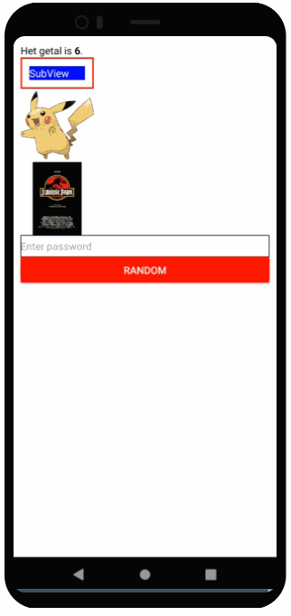

# Labo 2

Voor dit labo moet je de volgende theorie bekeken hebben:
- Core Components
- Event Handling

## Opdracht: Core Components

### Maak een nieuw project aan

Maak een nieuw project `CoreComponents` aan met expo. Vervang de inhoud van `App.tsx` door de volgende code:

```typescript expo={}
import React from "react";
import { Text, View, StyleSheet, Button } from "react-native";

const App = () => {
  return (
    <View style={styles.container}>
    </View>
  );
}

const styles = StyleSheet.create({
  container: {
    flex: 1,
    backgroundColor: "#ff",
  },
});

export default App;
```

Verwijder alle styles in container maar laat backgroundColor staan.

### Tekst toevoegen

- Maak een functie die een willekeurig getal tussen 0 en 10 teruggeeft. Noem deze functie `random0To10`.
- Voeg een Text component toe aan de View van de App functie component. Als tekst toon je het getal dat `random0To10` teruggeeft.
- Voeg daarna ook de tekst `Het getal is` toe aan deze Text component met daarachter het getal (zonder extra Text component te gebruiken)
- Gebruik nu een tweede Text component om het getal in drukletters te tonen. Maak hiervoor een style `boldText` aan die je gebruikt via het `styles` attribuut.

### Styling

Maak een nieuwe View als kind van de originele View aan. Plaats daarin een Text component met de tekst `SubView`.

Geef Subview een breedte van 100. Geef het een rode rand van breedte 2, een padding van 10.

Geef het nieuwe `Text` component in Subview een blauwe achtergrond met witte letters.

### Images

Voeg 2 afbeeldingen toe aan de originele view: 1 afbeelding van een Pokemon die je lokaal toevoegt aan jouw project en een andere afbeelding van een filmposter die je via de URL aanspreekt (en dus niet downloadt).

Geef beide afbeeldingen een breedte en hoogte van 100.

Zorg dat beide afbeeldingen volledig te zien zijn.

### Input

Voeg een TextInput component toe die 
- een zwarte rand heeft
- de tekst verstopt die je typt (als een password)
- als standaard text "Enter Password" toont
- de tekst aan de gebruiker toont via een alert wanneer de gebruiker de enter (return/submit) toets gebruikt

Voeg een Button component toe die
- rood is 
- de tekst Random bevat
- wanneer een gebruiker erop drukt, de alert The number is X waar X een waarde is die Random0To10 teruggeeft (dit hoeft niet dezelfde waarde te zijn als die in het tekst veld)

Zorg dat wanneer een gebruiker de Pokemon 3 seconden indrukt, je de naam van de Pokemon in een alert toont. 



## Opdracht: RandomMoviePosters

Maak een nieuw expo project aan met de naam `RandomMoviePosters`.

Zorg dat de app
- de 6 posters onder mekaar toont
- de posters volledig te zien zijn met een maximum hoogte van 50
- de volgorde van de posters verandert elke keer de de app opnieuw laadt
- als je op een poster drukt, krijg je een alert met de filmnaam als titel en jaar als beschrijving eronder.

Zorg ook dat:
- de data van posters (url, name, year) in een array van JSON objecten zitten (hoeft geen externe file te zijn, mag een variable zijn)
- een filmposter maar 1 keer op het scherm getoond wordt
- **tip:** je gebruikt 6 keer de Image tag (dus geen loops, dat zien we later)

